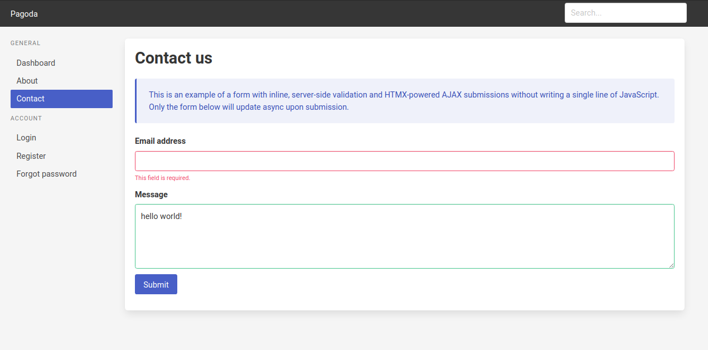
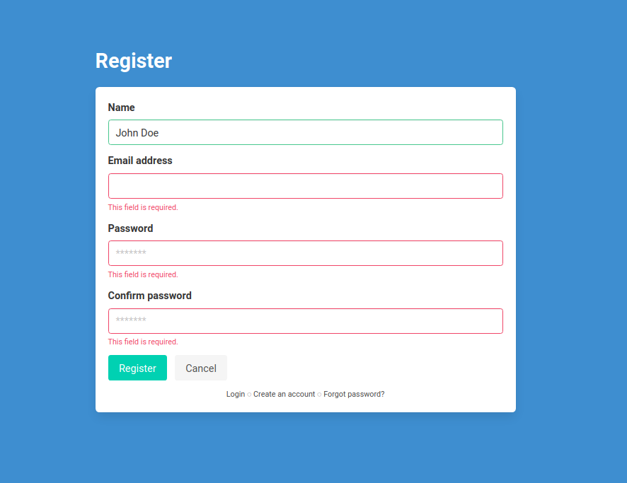
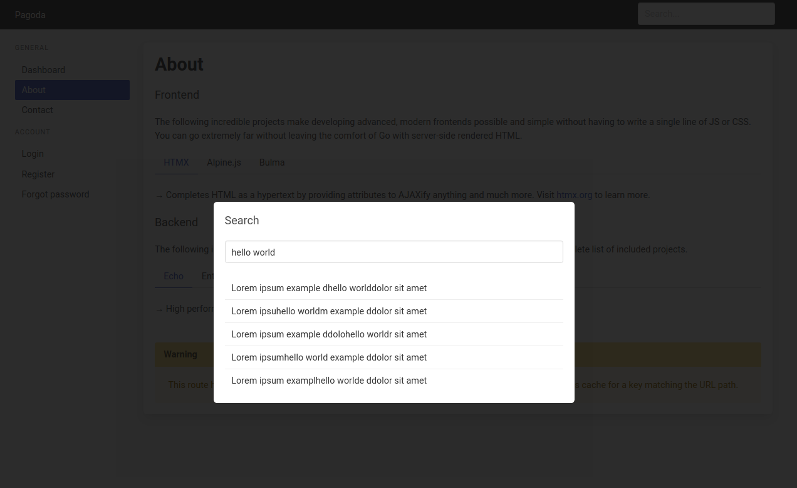

## Rapid, easy full-stack web development starter kit in Go


#### Backend

- [Echo](https://echo.labstack.com/): High performance, extensible, minimalist Go web framework.
- [Ent](https://entgo.io/): Simple, yet powerful ORM for modeling and querying data.

#### Frontend

Go server-side rendered HTML combined with the projects below enable you to create slick, modern UIs without writing any JavaScript or CSS.

- [HTMX](https://htmx.org/): 
- [Alpine.js](https://alpinejs.dev/): 
- [Bulma](https://bulma.io/): P

#### Storage

- [SQLite](https://sqlite.org/): A small, fast, self-contained, high-reliability, full-featured, SQL database engine and the most used database engine in the world.


### Screenshots

#### Inline form validation



#### Switch layout templates, user registration



#### Alpine.js modal, HTMX AJAX request



## Getting started

### Dependencies

Ensure that [Go](https://go.dev/) is installed on your system.

### Start the application

After checking out the repository, from within the root, simply run `make run`:

```
git clone git@github.com:allpyjs/go-fullstack-webkit.git
cd go-fullstack-webkit
make run
```

Since this repository is a _template_ and not a Go _library_, you **do not** use `go get`.

By default, you should be able to access the application in your browser at `localhost:8000`. This can be changed via the [configuration](#configuration).

By default, your data will be stored within the `dbs` directory. If you ever want to quickly delete all data just remove this directory.

### Running tests

To run all tests in the application, execute `make test`. This ensures that the tests from each package are not run in parallel. This is required since many packages contain tests that connect to the test database which is stored in memory and reset automatically for each package.

## Service container

The container is located at `pkg/services/container.go` and is meant to house all of your application's services and/or dependencies. It is easily extensible and can be created and initialized in a single call. The services currently included in the container are:

- Configuration
- Cache
- Database
- ORM
- Web
- Validator
- Authentication
- Mail
- Template renderer
- Tasks

A new container can be created and initialized via `services.NewContainer()`. It can be later shutdown via `Shutdown()`.


## Database

The database currently used is [SQLite](https://sqlite.org/)


#### Conditional processing / rendering

Since HTMX communicates what it is doing with the server, you can use the request headers to conditionally process in your _route_ or render in your _template_, if needed. If your routes aren't doing multiple things, you may not need this, but it's worth knowing how flexible you can be.


## Roadmap

Future work includes but is not limited to:

- Flexible pager templates
- Expanded HTMX examples and integration
- Admin section

